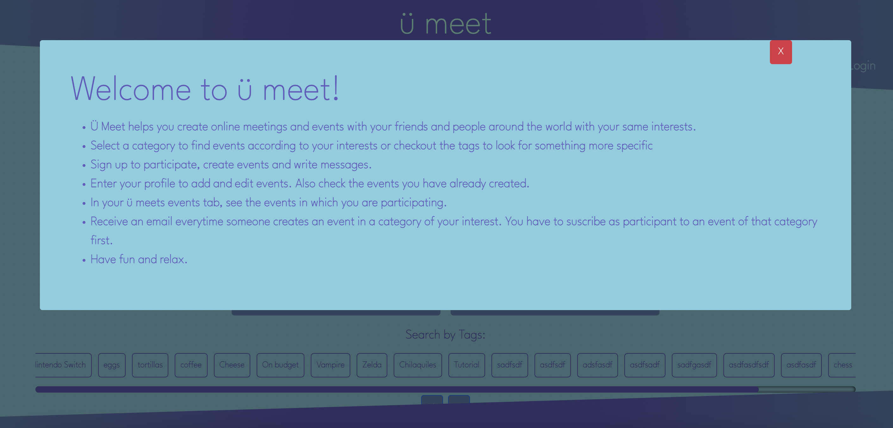
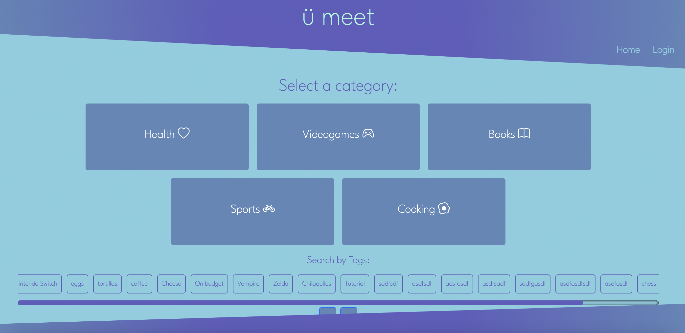
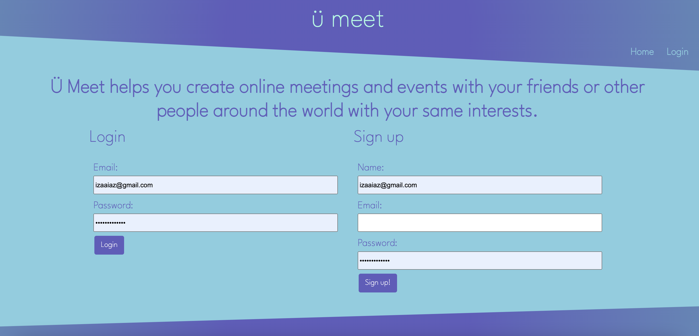
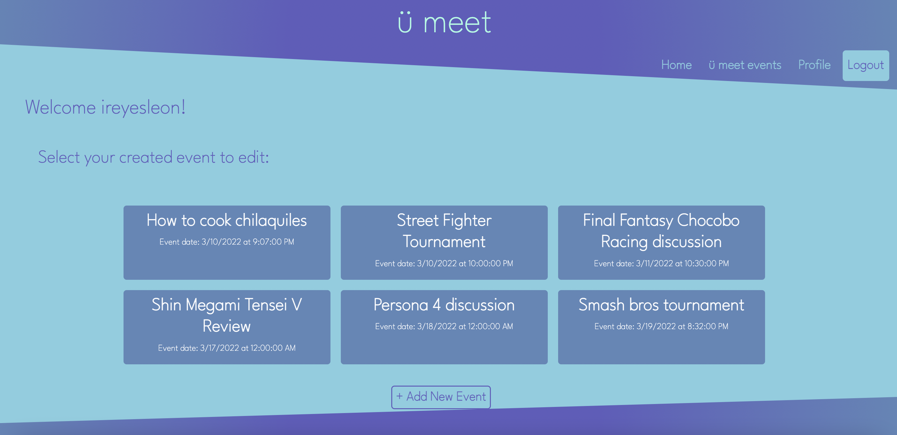
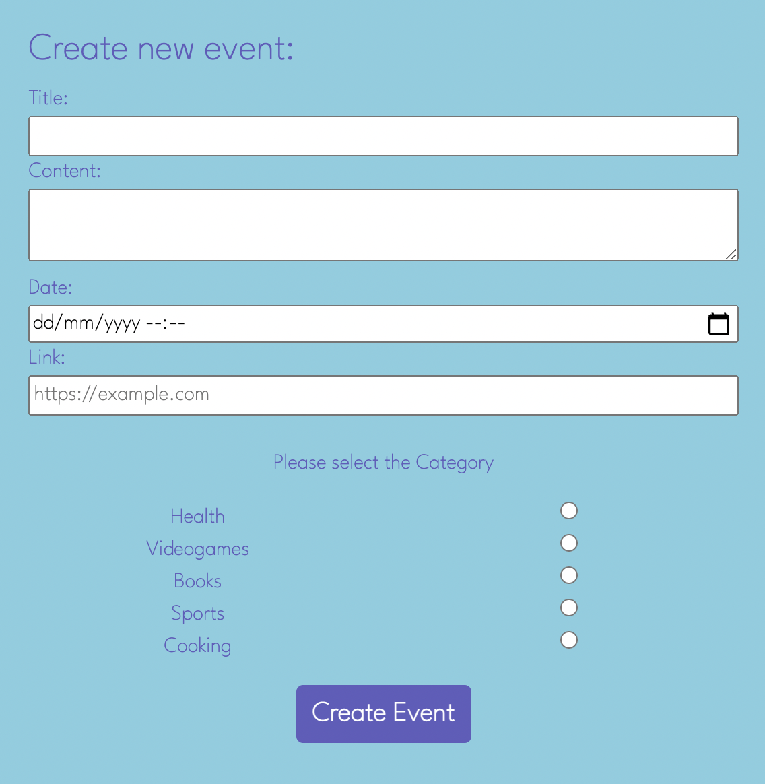
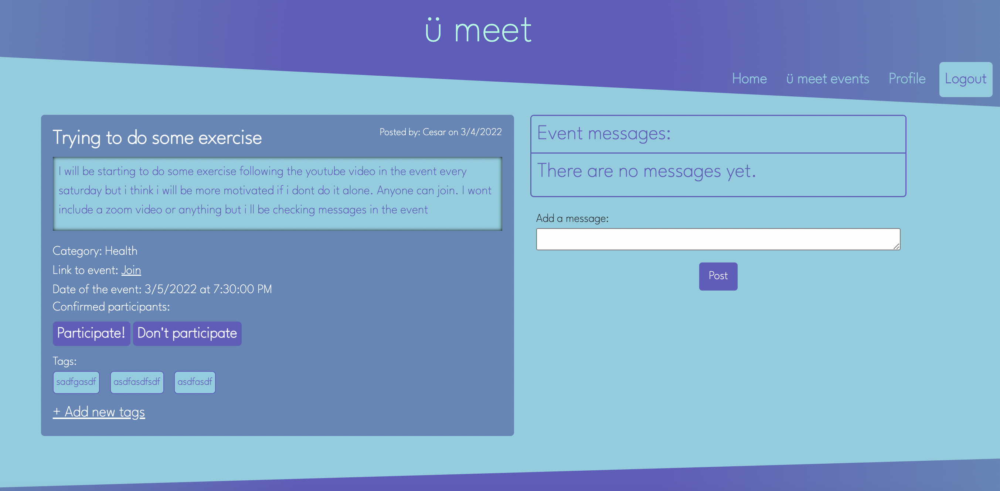
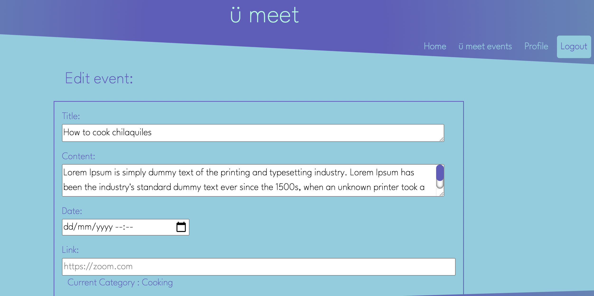
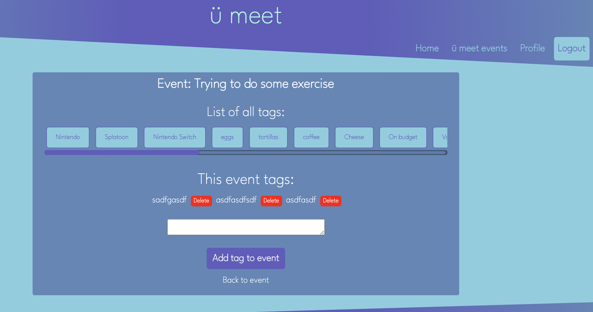
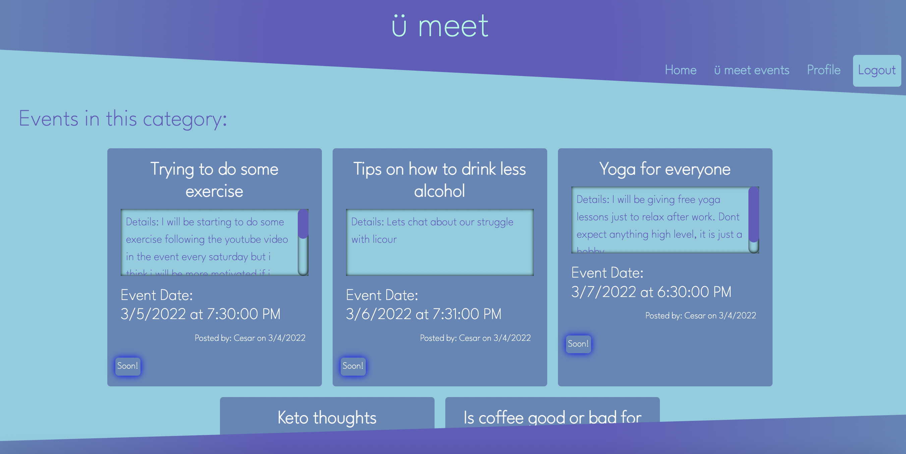
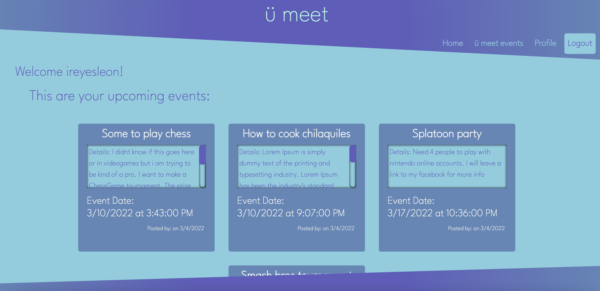

# ü meet
  
  # Table of contents
  * [Description](#description)
  * [Installation](#installation)
  * [Usage](#usage)
  * [License](#license)
  * [Contribution](#contribution)
  * [Tests](#tests)
  * [Questions](#questions)
  

  ## Description
  This is a social application to get people together by participating in online events hosted by others with similar 
  interests. Besides offering a safe space to socialize during pandemic, we also want to offer a platform to enjoy life by 
  sharing experiences with others.

  The technologies used in this project are:
  - Javascript
  - CSS
  - Handlebars
  - Node-mailer
  - Bootstrap


  ## Installation
  Download this repo, run npm i to install all the modules and packages required.


  ## Usage
  This app objective is to become a social network where people can gather and enjoy discussing, playing, learning with other people no matter where they are.
  

  ## License
    Project Licensed under ISC


  ## Contribution
  The devolopers involved in this project are:

  - César Sánchez: Leader, API, home-routes, models, Client JS, handlebars.
  - Isaias Reyes Leon: Design, Handlebars, CSS, Bootstrap.
  - Regulo Argotte: API, home-routes, models, Client JS.

  ## Tests
  
  Go to the live [application](https://u-meet-app.herokuapp.com/) to test it
  
  ## User Story
  ```
  AS a user I want to
  create an online event
  Add details to this event
  Description, Date, Time, Link, Tags
  Check who is attending my event
  Be notified about the creation of my event
  As a Participant I want to
  Display all events and details
  By Category
  By Tags
  Comment on events 
  Subscribe/Unsubscribe to an event
  ```


  ## Acceptance Criteria
  ```
  WHEN I enter the app then I'm presented with a pop up explaining how to use the app
  THEN I can close it and view the homepage
  WHEN I click the log in section
  THEN I'm presented with the option to log in or sign up
  WHEN I log in/sign up 
  THEN I'm redirected to my profile where I can view my events created or create a new event
  WHEN I can create a new event with all the details
  THEN all the users that already participated in the same category will receive an email 
  WHEN I enter the homepage I'm presented with a list of categories
  THEN I can select the category I want to see the events
  THEN I can participate in the event
  THEN I can send messages inside the event
  THEN I can add new tags to the event so it's easier to find by other users
  ```


  ## Mock-Up
  The following images show the application appearance and functionality:
  - Landing page
  

  - Homepage
  

  - Log in/Sign up page
  

  - User profile
  

  - Create a new event
  

  - Event detail
  

  - Edit event
  

  - Add new tags to event
  

  - Event list for a category
  

  - Participating events of a user
  


  ## Questions
  If you have any question please feel free to reach the dev team:
  * [csancheze](https://github.com/csancheze)
  * [ireyesleon](https://github.com/ireyesleon)
  * [rargotte](https://github.com/rargotte)
  
